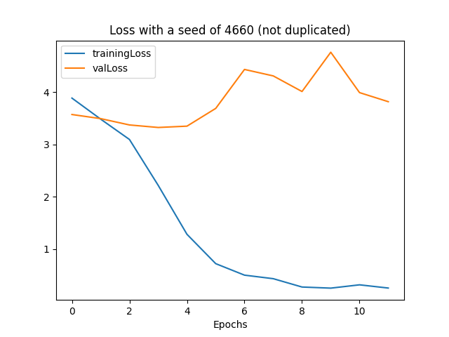
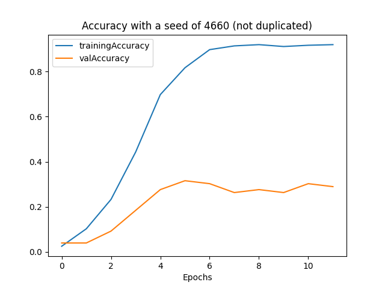
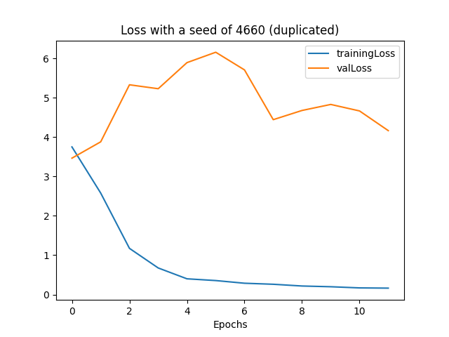
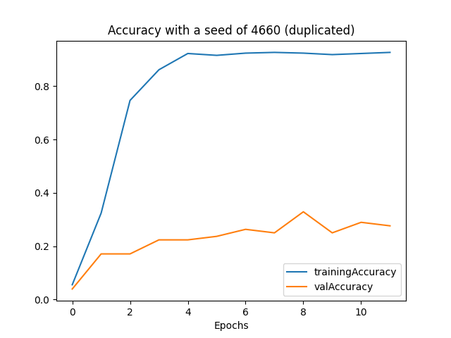

# Detecting LEGO Minifigures with TensorFlow
## Robert Beane, Kyle Day, Jacob Jenness

# Table of Contents
* [LEGO Dataset](#Dataset)
* [First Run Instructions](#First-Run-Instructions)
* [File Overview](#Files)
* [Overview](#Overview)
    * [Design Matrix](#Design-Matrix)
    * [Sample Rows](#Sample-Rows)
    * [Model Summary](#Model-Summary)
    * [Goals and Hypothesis](#Goals-and-Hypothesis)
    * [Project Methods](#Project-Methods)
    * [Training Process](#Training-Process)
* [Design Process](#Design-Process)
    * [Code Tinkering](#Code-Tinkering)
    * [Regularization Attempts](#Regularization-Attempts)
* [Results](#Results)
* [Challenges](#Challenges)

## Dataset
Dataset Source : [Kaggle LEGO Minifigures](https://www.kaggle.com/datasets/ihelon/lego-minifigures-classification)

## First Run Instructions
Before you can run the Convolutional Neural Network (CNN), you have to install the required dependencies.
To do so, run the following command in your terminal.

```pip install -r requirements.txt```

You also must install Graphviz which can be done [here](https://graphviz.org/download/).

## Files
* [normalizeTraining.py](normalizeTraining.py)  - Script for normalizing images, was not used in the final CNN.
* [multiLayer.py](multiLayer.py)  - Runs implementation of Multi Layer Perceptron (low accuracy).
* [convolutional.py](convolutional.py)  - Runs the CNN for the LEGO dataset; the final, main implementation.

## Overview

### Design Matrix
Our design matrix consists of three categories of LEGO Minifigures: Star Wars, Marvel, and other. From there, 37 subcategories are distributed among them, numbered starting at 0001 and generally consisting of less than thirty 512 by 512 images a piece (after duplication). 
These subcategories identify characters that LEGO has made Minifigures for (e.g., Yoda, Captain America, Harry Potter, etc.). To identify them more specifically, each subcategory is labeled with a number from 1-37 in the three CSV files included.

The images are preprocessed before training through downsizing by a scale of two (i.e., 512 x 512 down to 256 x 256). It is possible to run the neural network without any preprocessing, but this significantly increases the training and validation times, as well as the quality of results.

### Sample Rows
#### ```index.csv```
|path               |class_id|
|-------------------|--------|
|marvel/0001/001.jpg|1       |
|marvel/0001/002.jpg|1       |
|marvel/0001/003.jpg|1       |

#### ```test.csv```
|path               |class_id|
|-------------------|--------|
|test/001.jpg       |32      |
|test/002.jpg       |32      |
|test/003.jpg       |32      |

#### ```metadata.csv```
|class_id           |lego_ids|lego_names               |minifigure_name|
|-------------------|--------|-------------------------|---------------|
|1                  |[76115] |['Spider Mech vs. Venom']|SPIDER-MAN     |
|2                  |[76115] |['Spider Mech vs. Venom']|VENOM          |
|3                  |[76115] |['Spider Mech vs. Venom']|AUNT MAY       |

### Model Summary
```
Model: "model"
_________________________________________________________________
 Layer (type)                Output Shape              Param #   
=================================================================
 input (InputLayer)          [(None, 256, 256, 3)]     0         
                                                                 
 conv_1_1 (Conv2D)           (None, 254, 254, 10)      280       
                                                                 
 conv_1_2 (Conv2D)           (None, 252, 252, 10)      910       
                                                                 
 max_pool_1 (MaxPooling2D)   (None, 126, 126, 10)      0         
                                                                 
 conv_2_1 (Conv2D)           (None, 124, 124, 10)      910       
                                                                 
 conv_2_2 (Conv2D)           (None, 122, 122, 10)      910       
                                                                 
 max_pool_2 (MaxPooling2D)   (None, 61, 61, 10)        0         
                                                                 
 flatten_layer (Flatten)     (None, 37210)             0         
                                                                 
 output_layer (Dense)        (None, 36)                1339596   
                                                                 
=================================================================
```

### Goals and Hypothesis

Our primary goal with this project was to be able to accurately process the training and validation data above a threshold of 20%. Our hypothesis was that we would eventually be able to balance out these accuracies through tweaks to our neural network design (different filter counts, activation functions, kernel sizes, etc.).

### Project Methods
Our first implementation utilizes an MLP (multilayer perceptron) to train and validate data. It's quite minimal, using a classic setup for a neural network: one input layer, two hidden layers, and one output layer. No convolutions are used to take on portions of the data. The images are taken in, preprocessed using a built in keras function, and sent sequentially through the neural network. The output for loss and accuracy are very low.

Our final implementation utilizes a CNN (convolutional neural network) to train and validate data. This neural network is particulary effective for image processing. Images consist of multidimensional data which can be quite complex to process and analyze. 
CNNs are able to reduce the dimensionality of images by taking portions of the data and filtering it through their networks of layers. A great amount of precision can be acquired by implementing a CNN structure, as will be discussed later on.

### Training Process

Our dataset already came with a set for training (```index.csv```) that contained the ```class_id``` and ```path``` for the image. The set already came with a pre-done testing dataset (```test.csv```)
This file had the same format as ```index.csv``` but consisted of randomly selected images of specific characters. We attempted adding our own images of the same characters to the training dataset but found that our accuracy became much more inconsistent. We also decided to use our testing dataset as our validation dataset. This could also be a cause for the low validation accuracy we see in our network.

## Design Process

### Architecture Change

As mentioned previously, we ended up converting the neural network from a MLP to a CNN. In an attempt to try and mitigate the accuracy problem, we tried condensing the now non-existent Harry Potter and Jurassic World categories into an Other category to try and see if the accuracy would improve, but it did nothing worth noting. The subcategories (which is really what the neural network is after) were still the same as they were before, just reorganized. At that point, we chose to give a convolutional neural network a try. The improvement made to the training and validation were immediately apparent. The training data went from being ~5% accurate to ~90% accurate, while the validation data went from being around the same low to ~30% accurate. The loss also increased for both, indicating that the process was not static. But, there was clearly an issue with overfitting. Thus, we ended up tinkering with the code to see if we could mitigate that issue.

### Code Tinkering

A few settings were altered briefly to examine how certain aspects of our code affected our output. These tests were done after an attempt was made to  resplit data to balance the loss and accuracy of our model. The re-split charts can be found below:

```Loss (re-split)```

/24%20Epochs/2%20Pools%20(Standard)/Loss.png)

```Accuracy (re-split)```

/24%20Epochs/2%20Pools%20(Standard)/Accuracy.png)

#### Changing Activation Functions
In one test, the final activation function was changed from softmax to sigmoid. Not much changed occurred from the default model.

```Loss (sigmoid output)```


```Accuracy (sigmoid output)```


In another test, we changed an couple of instances of ReLU activation layers to sigmoid, while maintaining a softmax output. While this eventually lead to a loss of zero for both training and validation, it tanked accuracy across the board.

```Loss (sigmoid activation)```


```Accuracy (sigmoid activation)```


#### Changing Kernel Sizes
The kernel amounts were also modified, with one test setting them to 1 and another test setting them to 5. A run with a kernel size of 1 was much faster to process, but there was little benefit. A run with a kernel size of 5 was much slower to process, but it proved to be detrimental.

```Loss (kernel size of 1)```

/Loss.png)

```Accuracy (kernel size of 1)```

/Accuracy.png)

```Loss (kernel size of 5)```

/Loss.png)

```Accuracy (kernel size of 5)```

/Accuracy.png)


### Regularization Attempts

After we began work on duplicating our data, we attempted to regularize our model through the use of L1 and L2 norms. The default model can be found in the results section (pre-duplication). The L1 and L2 norms are often used to curb overfitting, but they did not provide a significant improvement for our model.

#### L1 Regularization

```Loss (L1 regularization)```


```Accuracy (L1 regularization)```


#### L2 Regularization

```Loss (L2 regularization)```


```Accuracy (L2 regularization)```


## Results

When running our network we discovered that our accuracy is pretty high and our loss is pretty low. However, our validation accuracy is relatively low compared to training and our validation loss is much higher than the training loss.
Because of this observation, we tried duplicating our testing data so that we have a higher percentage of training vs testing. For accuracy, we discovered that the accuracy rose quicker than before but our validation accuracy was still low. 
The same could be said for the training loss and validation loss. Our results for each case can be seen in the charts below.
#### ```Loss (not duplicated training data)```


#### ```Accuracy (not duplicated training data)```


#### ```Loss (duplicated training data)```


#### ```Accuracy (duplicated training data)```


We think this is a result of overfitting. We believe this is due to the number of categories we have and how we only have a few images per category.
If our dataset had more images of each minifig, we think that we could get our validation accuracy higher and our validation loss lower.

## Challenges
Our main challenge was working with as little data as we had. The best image recognition neural networks take in thousands images for training and validation each - but this data set only has a few hundred images. While we managed to significantly upgrade our training accuracy in the development of the CNN, 
there always seemed to be a low asymptote which our validation data could never go over once we reached a certain threshold. The most substantial way to improve this model would be to find more images of minifigures included to train on and validate.
